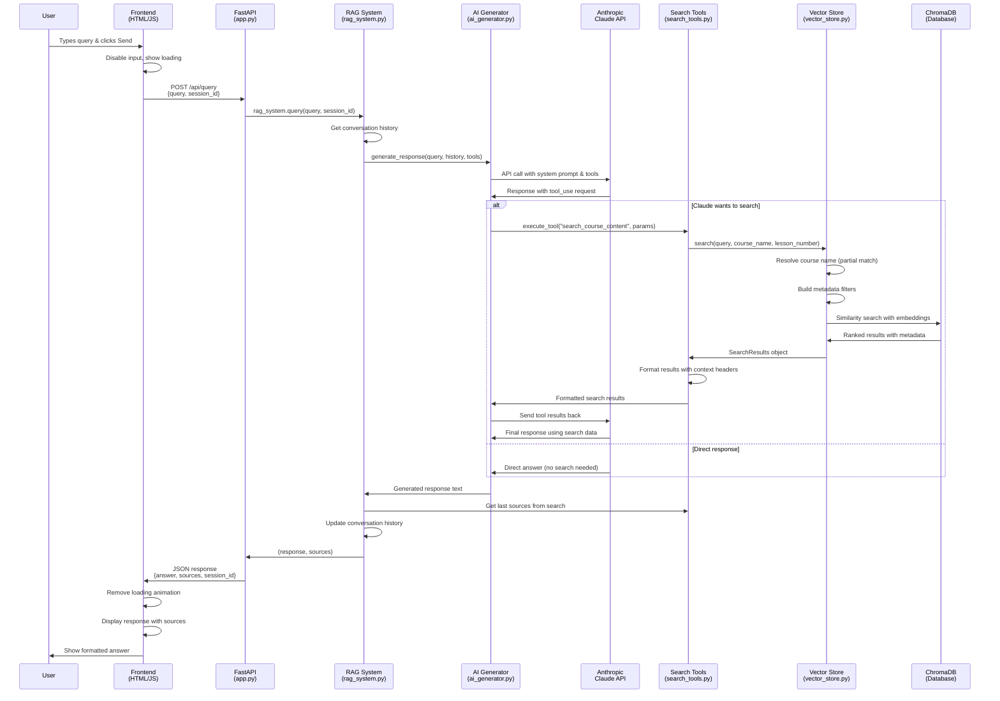

# RAG System Query Flow Diagram

## Component Responsibilities

### Frontend Layer
- **User Interface**: Input handling, message display, loading states
- **API Communication**: HTTP requests to backend endpoints
- **Session Management**: Tracks conversation continuity

### Backend API Layer  
- **FastAPI Router**: Request validation, error handling, response formatting
- **Session Management**: Creates/manages user sessions

### RAG Orchestration Layer
- **RAG System**: Coordinates all components, manages conversation flow
- **Tool Management**: Registers and executes available tools

### AI Layer
- **AI Generator**: Interfaces with Claude API, handles tool execution flow
- **Anthropic Claude**: Decides when to search, generates final responses

### Search Layer
- **Search Tools**: Formats queries, processes results for AI consumption  
- **Vector Store**: Semantic search, course name resolution, filtering

### Data Layer
- **ChromaDB**: Vector embeddings, similarity search, metadata storage

## Key Data Transformations

1. **User Query** → HTTP JSON request
2. **RAG Prompt** → "Answer this question about course materials: {query}"
3. **Tool Call** → `search_course_content(query, course_name, lesson_number)`
4. **Vector Search** → ChromaDB similarity query with filters
5. **Search Results** → Formatted context with headers: `[Course Title - Lesson X] content`
6. **AI Response** → JSON with answer, sources, and session_id
7. **Frontend Display** → Rendered markdown with collapsible sources

## Flow Characteristics

- **Async Processing**: Frontend shows loading while backend processes
- **Tool-Based Search**: AI decides when to search based on query type
- **Context Preservation**: Conversation history maintained across queries  
- **Source Tracking**: Search results tracked and displayed to user
- **Error Handling**: Graceful fallbacks at each layer